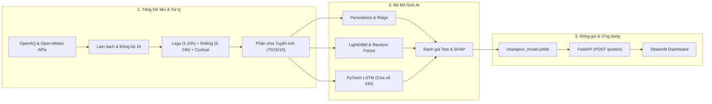

# Dự Báo Nồng Độ Bụi Mịn PM2.5 Tại Hà Nội Bằng Trí Tuệ Nhân Tạo
## AI-Based Time-Series Forecasting of PM2.5 for Hanoi

> **Môn học:** Đồ án Cuối kỳ Trí tuệ Nhân tạo (*Artificial Intelligence Final Project*)  
> **Bài toán:** Dự báo chuỗi thời gian đa biến có giám sát nồng độ bụi mịn $\text{PM}_{2.5}$ trong 24 giờ tiếp theo ($t + 24\text{h}$)  
> **Khu vực nghiên cứu:** Thành phố Hà Nội (Trạm quan trắc mặt đất Đại sứ quán Hoa Kỳ & lưới khí tượng bề mặt)  
> **Dự án nền tảng (Upstream):** [`doctor-cato/air-pollution-analysis`](https://github.com/doctor-cato/air-pollution-analysis)  
> **Quy mô nhóm:** 5 thành viên (Phân định chuyên trách kỹ thuật + Bảo vệ cá nhân độc lập)

---

## 1. Tổng quan Đề tài & Giá trị Thực tiễn

Bụi mịn $\text{PM}_{2.5}$ (các hạt bụi có đường kính khí động học $\le 2.5\,\mu\text{m}$) là tác nhân ô nhiễm không khí nguy hại hàng đầu tại các đô thị lớn như Hà Nội. Do kích thước siêu nhỏ, $\text{PM}_{2.5}$ có khả năng thâm nhập sâu vào phế nang phổi và đi vào hệ tuần hoàn máu, gây ra các bệnh lý tim mạch và hô hấp nghiêm trọng.

Tại khu vực Hà Nội, nồng độ $\text{PM}_{2.5}$ chịu tác động phức tạp bởi hoạt động giao thông đô thị, mật độ xây dựng, hoạt động công nghiệp tại vùng đồng bằng sông Hồng, đốt phụ phẩm nông nghiệp sau thu hoạch và đặc biệt là hiện tượng **nghịch nhiệt bức xạ mùa đông** (*winter temperature inversion*).

Nếu như dự án Khoa học Dữ liệu thượng nguồn (*Upstream Data Science*) tập trung vào phân tích khám phá (EDA), kiểm định thống kê và phân loại cảnh báo, thì **dự án Trí tuệ Nhân tạo này phát triển một hệ thống học máy hoàn chỉnh để dự báo liên tục nồng độ $\text{PM}_{2.5}$ trước 24 giờ ($t + 24\text{h}$)**:

1. **Dự báo chuỗi thời gian đa biến có giám sát:** Kết hợp chuỗi quan trắc nồng độ $\text{PM}_{2.5}$ trong quá khứ với các biến khí tượng bề mặt (nhiệt độ, độ ẩm tương đối, tốc độ gió, hướng gió, lượng mưa, áp suất khí quyển).
2. **Kỹ nghệ đặc trưng phi rò rỉ (*Leakage-Safe Feature Engineering*):** Xây dựng các đặc trưng trễ (*lags*), thống kê trượt (*rolling statistics*) và mã hóa chu kỳ ngày/mùa hoàn toàn từ quá khứ ($t' \le t$); phân chia tập huấn luyện/kiểm tra nghiêm ngặt theo trình tự thời gian.
3. **Tiến trình mô hình hóa đa tầng:** Đo đạc thực nghiệm từ mô hình cơ sở ngây thơ (*Naive Persistence Baseline*), hồi quy tuyến tính điều hòa (*Ridge Regression*), cây quyết định tăng cường (*LightGBM / Random Forest*), đến mạng nơ-ron hồi quy chuỗi sâu (*PyTorch LSTM*).
4. **Giải thích mô hình (*Explainability*):** Ứng dụng Tree SHAP để định lượng mức độ đóng góp của từng yếu tố khí tượng và lịch sử ô nhiễm vào kết quả dự báo.
5. **Ứng dụng thực tiễn (*Serving & Product*):** Đóng gói mô hình thành dịch vụ REST API bằng FastAPI (`POST /predict`) và giao diện trực quan hóa tương tác Streamlit Web Dashboard phục vụ cộng đồng.

> [!NOTE]
> **Tuyên bố Phạm vi Đạo đức & Khuyến cáo Thực tiễn:**  
> Hệ thống dự báo này được phát triển như một công cụ nghiên cứu học thuật hỗ trợ cảnh báo sớm. Kết quả dự báo của mô hình **không thay thế** các bản tin quan trắc quy chuẩn hoặc cảnh báo chính thức từ Sở Tài nguyên và Môi trường Hà Nội (DONRE) hay Bộ Tài nguyên và Môi trường (MONRE).

---

## 2. Mối Liên Hệ Với Dự Án Khoa Học Dữ Liệu Thượng Nguồn

Dự án AI kế thừa có chọn lọc các tiêu chuẩn quản trị dữ liệu từ repository Data Science tiền đề ([`doctor-cato/air-pollution-analysis`](https://github.com/doctor-cato/air-pollution-analysis)), đồng thời thiết lập một pipeline AI/ML độc lập, khép kín:

```text
Dự án Khoa học Dữ liệu (CRISP-DM)
   │
   ├── Lược đồ dữ liệu chuẩn hóa (Canonical Data Schema)
   ├── Quy ước xử lý khuyết thiếu (Strict Missingness Protocol)
   └── Kiểm toán tính hợp lý vật lý (Physical Validation Constraints)
   ▼
Tập dữ liệu tích hợp đã xác thực (Hourly Parquet)
   ▼
Dự án Trí tuệ Nhân tạo (PM2.5-Prediction-for-Hanoi)
   │
   ├── [1] Kỹ nghệ đặc trưng chuỗi thời gian (Lags, Rolling Means, Sin/Cos Cycles)
   ├── [2] Phân chia chuỗi thời gian tuyến tính (Train 70% | Val 15% | Test 15%)
   ├── [3] Bộ mô hình AI (Persistence, Ridge, LightGBM, PyTorch LSTM)
   ├── [4] Đánh giá đa chỉ số chuẩn mực (MAE, RMSE, R², Sai số đợt đỉnh)
   ├── [5] Giải thích khí tượng bằng Tree SHAP
   ├── [6] Đóng gói Inference Engine độc lập (PM25Forecaster)
   └── [7] Giao diện người dùng & API (FastAPI REST Service + Streamlit Dashboard)
```

---

## 3. Kiến Trúc Hệ Thống Tổng Thể



---

## 4. Cấu Trúc Thư Mục Dự Án

```text
PM2.5-Prediction-for-Hanoi/
├── .gitignore                          # Quy tắc loại trừ tệp nhị phân, dữ liệu và cache
├── README.md                           # Tài liệu tổng quan dự án (Tiếng Việt)
├── requirements.txt                    # Danh sách thư viện phụ thuộc Python 3.10+
│
├── configs/                            # Tệp cấu hình tham số hệ thống
│   ├── data_config.yaml                # Tọa độ trạm, endpoint API và khoảng thời gian
│   ├── features_config.yaml            # Danh sách độ trễ, cửa sổ trượt và chuẩn hóa
│   └── model_config.yaml               # Siêu tham số LightGBM và mạng LSTM
│
├── data/
│   ├── raw/                            # Dữ liệu thô tải về (Chỉ đọc, bất biến, gitignored)
│   ├── interim/                        # Dữ liệu sạch đã căn chỉnh lưới thời gian 1 giờ
│   └── processed/                      # Ma trận đặc trưng và các tập Train/Val/Test
│
├── src/                                # Package mã nguồn Python module hóa
│   ├── data/                           # Thu thập dữ liệu, làm sạch và reindex chuỗi thời gian
│   ├── features/                       # Kỹ nghệ đặc trưng trễ, thống kê trượt và bộ chia tập
│   ├── models/                         # Baseline, Ridge, LightGBM, PyTorch LSTM và Model Registry
│   ├── evaluation/                     # Tính toán độ đo (MAE, RMSE, R²) và giải thích SHAP
│   └── inference/                      # Lớp suy luận dự báo độc lập (PM25Forecaster)
│
├── notebooks/                          # Chuỗi Jupyter Notebooks nghiên cứu tuần tự
│   ├── 01_data_audit_and_prep.ipynb    # Kiểm toán dữ liệu và căn chỉnh lưới thời gian 1 giờ
│   ├── 02_feature_engineering.ipynb    # Sinh đặc trưng trễ và phân tích tự tương quan (ACF)
│   ├── 03_baseline_and_classical.ipynb # Đo đạc mô hình Persistence, Ridge, Random Forest, LightGBM
│   ├── 04_deep_learning_lstm.ipynb     # Huấn luyện chuỗi sâu PyTorch LSTM và Early Stopping
│   └── 05_evaluation_and_shap.ipynb    # Đánh giá tập Test, sai số đợt ô nhiễm cao và phân tích SHAP
│
├── models/                             # Trọng số mô hình đã huấn luyện (.joblib, .pt, scaler.pkl)
├── api/                                # Dịch vụ FastAPI (main.py, schemas.py)
├── app/                                # Ứng dụng giao diện Streamlit (streamlit_app.py)
├── figures/                            # Biểu đồ ấn phẩm chất lượng cao (300 DPI)
├── reports/                            # Báo cáo PDF cuối kỳ, slide thuyết trình và tệp nộp bài
└── docs/                               # Tài liệu thiết kế chi tiết & cẩm nang bảo vệ
    ├── problem_definition.md           # Đặc tả bài toán toán học & chống rò rỉ dữ liệu
    ├── architecture.md                 # Sơ đồ kiến trúc & giao diện các module
    ├── team_assignment.md              # Ma trận phân công nhiệm vụ 5 thành viên
    ├── github_issues.md                # Toàn văn đặc tả 16 GitHub Issues (#01 – #16)
    └── defense_preparation.md          # Bộ câu hỏi vấn đáp Viva (15 câu hỏi trọng tâm)
```

---

## 5. Phân Công Nhiệm Vụ Nhóm 5 Thành Viên

| Thành viên | Vai trò Kỹ thuật Chuyên trách | Module & Issues Phụ trách | Phần Báo cáo & Thuyết trình | Trọng tâm Vấn đáp Viva |
|---|---|---|---|---|
| **Thành viên 1** | **Trưởng nhóm Kỹ thuật Dữ liệu** (*Data Engineering Lead*) | #01, #03, #04, #16<br>• Pipeline thu thập OpenAQ & Open-Meteo<br>• Làm sạch tất định & reindex lưới 1h<br>• Kiểm toán tái lập môi trường sạch | • Mục 4: Tập dữ liệu & Xuất xứ<br>• Mục 5: Tiền xử lý & Kiểm toán<br>• Slide 4: Thu thập & Vệ sinh dữ liệu<br>• Đóng gói tệp ZIP nộp bài | Quy trình nạp dữ liệu, xử lý mất dữ liệu, logic vật lý, tính liên tục của chuỗi thời gian |
| **Thành viên 2** | **Trưởng nhóm Kỹ nghệ Đặc trưng & Baseline** (*Feature & Baseline Lead*) | #02, #05, #06, #14<br>• Đặc tả bài toán toán học<br>• Sinh lags, rolling stats & chia tập<br>• Mô hình Persistence & Ridge | • Mục 2: Phát biểu Bài toán<br>• Mục 6: Kỹ nghệ Đặc trưng<br>• Mục 7: Phương pháp AI Đề xuất<br>• Slide 3 & 5: Bài toán & Đặc trưng<br>• **Chủ biên Báo cáo PDF Cuối kỳ** | Cơ chế chống rò rỉ thời gian (*Temporal Leakage*), căn cứ chọn lags, baseline Persistence |
| **Thành viên 3** | **Trưởng nhóm Học máy Cổ điển & SHAP** (*Classical ML & Explainability Lead*) | #07, #10, #15<br>• Random Forest & LightGBM<br>• Tối ưu siêu tham số trên Validation<br>• Phân tích đóng góp Tree SHAP | • Mục 8: Phân tích Thuật toán<br>• Mục 9: Siêu tham số Mô hình<br>• Mục 14: Giải thích Mô hình (SHAP)<br>• Slide 6 & 10: Mô hình ML & SHAP<br>• **Phụ trách Thiết kế Slide Deck** | Bản chất thuật toán GBDT, căn cứ chọn siêu tham số, giải thích tương tác khí tượng qua SHAP |
| **Thành viên 4** | **Trưởng nhóm Học sâu & Đánh giá** (*Deep Learning & Evaluation Lead*) | #08, #09<br>• Bộ dữ liệu chuỗi 3D cho LSTM<br>• Vòng lặp huấn luyện PyTorch LSTM<br>• Bảng tổng hợp đối sánh độ đo<br>• Kiểm toán sai số đợt ô nhiễm cực đoan | • Mục 11: Thiết kế Thực nghiệm<br>• Mục 12: Kết quả Thực nghiệm<br>• Mục 13: So sánh Mô hình & Phần dư<br>• Slide 8 & 9: Kết quả & Phân tích sai số | Mô hình học sâu chuỗi thời gian, hội tụ hàm mất mát, phân tích nguyên nhân lệch ở các đỉnh ô nhiễm |
| **Thành viên 5** | **Trưởng nhóm Đóng gói Ứng dụng & Triển khai** (*Application & Deployment Lead*) | #11, #12, #13<br>• Pipeline suy luận `PM25Forecaster`<br>• Dịch vụ REST API (FastAPI)<br>• Web Dashboard tương tác (Streamlit) | • Mục 10: Kiến trúc Hệ thống<br>• Mục 15: Ứng dụng & Demo Thực tế<br>• Mục 16: Giới hạn Hệ thống & Đạo đức<br>• Slide 7 & 11: Kiến trúc & Demo Sản phẩm | Kiến trúc vận hành, độ trễ suy luận thời gian thực, xử lý lỗi khi thiếu dữ liệu đầu vào |

---

## 6. Lộ Trình Triển Khai 5–6 Tuần (Roadmap)

```text
Tuần 1: M0 Khởi tạo & M1 Đặc tả Bài toán & M2 Pipeline Thu thập Dữ liệu
        └── Issues #01, #02, #03
Tuần 2: M3 Làm sạch & Căn chỉnh & M4 Kỹ nghệ Đặc trưng & M5 Baseline
        └── Issues #04, #05, #06
Tuần 3: M5 Huấn luyện Học máy Cổ điển (LightGBM & Random Forest) & Tinh chỉnh
        └── Issue #07
Tuần 4: M6 Mạng Học sâu PyTorch LSTM & M7 Đánh giá Tổng thể & Phân tích SHAP
        └── Issues #08, #09, #10
Tuần 5: M8 Đóng gói Mô hình & M9 Dịch vụ FastAPI & Streamlit Dashboard & Viết Báo cáo
        └── Issues #11, #12, #13
Tuần 6: M10 Hoàn thiện Báo cáo PDF & Slide Thuyết trình & M11 Kiểm toán Tái lập & Vấn đáp Viva
        └── Issues #14, #15, #16
```

---

## 7. Hướng Dẫn Cài Đặt & Tái Lập Môi Trường

### Yêu cầu Tiên quyết
- Python 3.10 trở lên (Khuyến nghị: Python 3.10 – 3.12)
- Git

### Các bước Triển khai
```bash
# 1. Sao chép kho lưu trữ
git clone https://github.com/doctor-cato/PM2.5-Prediction-for-Hanoi.git
cd PM2.5-Prediction-for-Hanoi

# 2. Khởi tạo môi trường ảo
python -m venv .venv

# Kích hoạt trên Windows (PowerShell):
.\.venv\Scripts\Activate.ps1
# Kích hoạt trên Linux / macOS:
source .venv/bin/activate

# 3. Cài đặt các gói phụ thuộc cố định phiên bản
pip install -r requirements.txt
```

---

## 8. Nguyên Tắc Kỹ Thuật & Cam Kết Liêm Chính Học Thuật

1. **Tuyệt đối không ngụy tạo số liệu:** Mọi chỉ số đánh giá ($R^2$, MAE, RMSE) trong báo cáo và slide đều là kết quả thực tế đo đạc trên tập kiểm tra độc lập (*Test Set*).
2. **Triệt tiêu rò rỉ dữ liệu chuỗi thời gian (*Zero Temporal Leakage*):** Cấm tuyệt đối việc sử dụng `train_test_split` ngẫu nhiên. Mọi phép chuẩn hóa (*Scaler*) chỉ được học trên tập Train.
3. **Tuân thủ nguyên tắc thực dụng (Ponytail / YAGNI):** Ưu tiên hệ thống hoạt động ổn định, có tính giải thích cao và mã nguồn sạch sẽ, tránh đưa vào các kiến trúc Transformer cồng kềnh không khả thi trong quỹ thời gian 5–6 tuần.
