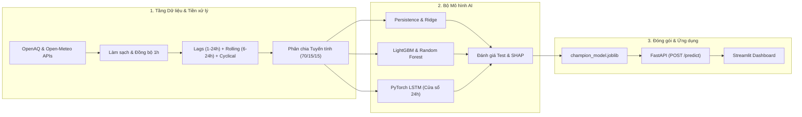

# Dự Báo Nồng Độ Bụi Mịn PM2.5 Tại Hà Nội Bằng Trí Tuệ Nhân Tạo
## AI-Based Time-Series Forecasting of PM2.5 for Hanoi

> **Môn học:** Đồ án Cuối kỳ Trí tuệ Nhân tạo (*Artificial Intelligence Final Project*)  
> **Bài toán:** Dự báo chuỗi thời gian đa biến có giám sát nồng độ bụi mịn $\text{PM}_{2.5}$ trong 24 giờ tiếp theo ($t + 24\text{h}$)  
> **Khu vực nghiên cứu:** Thành phố Hà Nội (Trạm quan trắc mặt đất Đại sứ quán Hoa Kỳ & lưới khí tượng bề mặt ERA5)  
> **Dự án nền tảng (Upstream):** [`doctor-cato/air-pollution-analysis`](https://github.com/doctor-cato/air-pollution-analysis)  
> **Phương pháp tiếp cận:** Tiến trình mô hình hóa đa tầng (Baseline $\rightarrow$ GBDT $\rightarrow$ Deep Learning)  
> **Thời lượng thực hiện:** 5–6 tuần  

---

### Thành Viên Nhóm Dự Án (5 Sinh viên)

| STT | Thành viên | Tài khoản GitHub | Vai trò Kỹ thuật Chuyên trách | Phụ trách Báo cáo & Thuyết trình |
|:---:|---|---|---|---|
| 1 | Huy | [@doctor-cato](https://github.com/doctor-cato) | **Nhóm trưởng & Data Lead** (Pipeline nạp dữ liệu, làm sạch, reindex 1h) | Mục 4 & 5 (Dữ liệu & Tiền xử lý), Slide 4 |
| 2 | Khương | [@lekhuong123456798-cpu](https://github.com/lekhuong123456798-cpu) | **Feature & Baseline Lead** (Đặc tả toán học, Causal Lags, Split, Baseline) | Mục 2, 6, 7 (Bài toán, Features, Baseline) – **Chủ biên Báo cáo** |
| 3 | Khánh | [@nguyenphanminhkhanh9a-netizen](https://github.com/nguyenphanminhkhanh9a-netizen) | **Classical ML & SHAP Lead** (Random Forest, LightGBM, Tree SHAP) | Mục 8, 9, 14 (Thuật toán, Tham số, SHAP) – **Trưởng thiết kế Slide** |
| 4 | Hưng | [@ViolaPeracia](https://github.com/ViolaPeracia) | **Deep Learning & Eval Lead** (PyTorch LSTM, Đối sánh độ đo, Sai số đỉnh) | Mục 11, 12, 13 (Thực nghiệm, Kết quả, Phần dư), Slide 8 & 9 |
| 5 | Hùng | [@Izuki-1780N](https://github.com/Izuki-1780N) | **Serving & Product Lead** (Inference Engine, FastAPI, Streamlit UI) | Mục 10, 15, 16 (Kiến trúc, Demo, Đạo đức), Slide 7 & 11 |

---

## 1. Hiện Trạng Triển Khai vs. Kế Hoạch Lộ Trình

> [!IMPORTANT]
> **Phân định minh bạch giữa mã nguồn hiện có và kế hoạch tương lai:**  
> Dự án đang ở giai đoạn **Tuần 01 – Milestone 0 (Khởi tạo Nền tảng & Đặc tả Bài toán)**. Toàn bộ các pipeline thu thập dữ liệu, huấn luyện mô hình học máy, dịch vụ API và giao diện Web Dashboard là kế hoạch đặc tả kỹ thuật và sẽ được hiện thực hóa tuần tự theo 7 Milestones chuẩn mực (#01 – #22).

- [x] **Milestone 0 – Khởi tạo Nền tảng (Tuần 01):**
  - Khởi tạo cây thư mục module hóa chuẩn (`src/`, `data/`, `notebooks/`, `models/`, `api/`, `app/`, `docs/`, `reports/`).
  - Cấu hình `.gitignore` cách ly dữ liệu thô, cache và tệp mô hình nhị phân.
  - Cố định phiên bản thư viện trong `requirements.txt` tương thích Python 3.10+.
  - Biên soạn tài liệu đặc tả toán học và bộ quy tắc chống rò rỉ dữ liệu ([`docs/problem_definition.md`](docs/problem_definition.md)).
  - Thiết lập sơ đồ kiến trúc hệ thống và ma trận phân công 5 thành viên ([`docs/architecture.md`](docs/architecture.md), [`docs/team_assignment.md`](docs/team_assignment.md)).
  - Khởi tạo hệ thống 7 Milestones và 9 Labels chuyên biệt trên GitHub Remote.
- [ ] **Milestone 1 – Đặc tả Bài toán & Nền tảng Dữ liệu (Tuần 01):** Xây dựng pipeline thu thập dữ liệu tự động OpenAQ và Open-Meteo ([Issue #05]); kiểm toán chất lượng và căn chỉnh lưới thời gian 1 giờ ([Issue #06]).
- [ ] **Milestone 2 – Tiền Xử lý & Kỹ nghệ Đặc trưng (Tuần 02):** Tạo biến mục tiêu $PM_{2.5}(t+24\text{h})$ ([Issue #07]); xây dựng đặc trưng trễ nhân quả và thống kê trượt ([Issue #08]); phân chia chuỗi thời gian tuyến tính 70/15/15 và cô lập bộ chuẩn hóa ([Issue #09]); kiểm toán zero-leakage ([Issue #10]).
- [ ] **Milestone 3 – Baseline & Học máy Cổ điển (Tuần 03):** Xây dựng baseline Persistence và hồi quy Ridge ([Issue #11]); huấn luyện Random Forest và LightGBM ([Issue #12]); tối ưu siêu tham số trên Validation ([Issue #13]).
- [ ] **Milestone 4 – Học sâu & Đánh giá Toàn diện (Tuần 04):** Phát triển mạng chuỗi sâu PyTorch LSTM ([Issue #14]); đánh giá đối sánh trên tập Test và kiểm toán sai số đỉnh ([Issue #15]); minh bạch hóa bằng Tree SHAP ([Issue #16]).
- [ ] **Milestone 5 – Đóng gói Suy luận, API & Demo (Tuần 05):** Đóng gói engine suy luận `PM25Forecaster` ([Issue #17]); xây dựng dịch vụ REST API bằng FastAPI ([Issue #18]); phát triển Web Dashboard tương tác bằng Streamlit ([Issue #19]).
- [ ] **Milestone 6 – Bàn giao Đồ án & Chuẩn bị Bảo vệ (Tuần 06):** Hoàn thiện Báo cáo PDF cuối kỳ 15–20 trang ([Issue #20]); thiết kế bộ 12 slide bảo vệ ([Issue #21]); kiểm toán tái lập môi trường sạch và luyện tập Viva 15 câu hỏi ([Issue #22]).

---

## 2. Tổng Quan Đề Tài & Giá Trị Thực Tiễn

Bụi mịn $\text{PM}_{2.5}$ (đường kính khí động học $\le 2.5\,\mu\text{m}$) là tác nhân ô nhiễm môi trường nguy hiểm hàng đầu tại Hà Nội do khả năng thâm nhập sâu vào phế nang phổi và mạch máu. Đề tài tập trung xây dựng một hệ thống học máy có khả năng:

1. **Dự báo chuỗi thời gian đa biến có giám sát:** Dự báo nồng độ $\text{PM}_{2.5}$ liên tục trước 24 giờ ($t + 24\text{h}$) từ lịch sử ô nhiễm và 6 yếu tố khí tượng bề mặt (nhiệt độ, độ ẩm, tốc độ gió, hướng gió, lượng mưa, áp suất khí quyển).
2. **Kỹ nghệ đặc trưng nhân quả (*Causal Feature Engineering*):** Trích xuất các biến trễ ($t-1$ đến $t-24$), giá trị trung bình trượt (6h, 12h, 24h) và chu kỳ thời gian lượng giác $\sin/\cos$ hoàn toàn từ quá khứ ($t' \le t$).
3. **Tiến trình mô hình hóa có kiểm chứng:** So sánh từ mô hình cơ sở ngây thơ (*Naive Persistence*), hồi quy điều hòa Ridge, cây tăng cường gradient (*LightGBM / Random Forest*) đến mạng chuỗi hồi quy sâu (*PyTorch LSTM*).
4. **Giải thích mô hình (*Explainability*):** Ứng dụng Tree SHAP để định lượng vai trò phát tán của gió và cơ chế tích tụ bụi do độ ẩm cao.
5. **Ứng dụng thực tế (*Serving & UI*):** Cung cấp API suy luận thời gian thực qua FastAPI và giao diện trực quan hóa tương tác qua Streamlit Dashboard.

> [!NOTE]
> **Khuyến cáo Đạo đức & Giới hạn Pháp lý:**  
> Hệ thống được thiết kế như một công cụ nghiên cứu học thuật hỗ trợ cảnh báo sớm. Kết quả dự báo **không thay thế** các bản tin quan trắc tiêu chuẩn hoặc cảnh báo chính thức từ Sở TN&MT Hà Nội (DONRE) hay Bộ TN&MT (MONRE).

---

## 3. Kiến Trúc Hệ Thống Tổng Thể



---

## 4. Cấu Trúc Thư Mục Dự Án

```text
PM2.5-Prediction-for-Hanoi/
├── .gitignore                          # Quy tắc loại trừ tệp nhị phân, dữ liệu và cache
├── README.md                           # Tài liệu tổng quan dự án (Tiếng Việt)
├── requirements.txt                    # Danh sách thư viện phụ thuộc Python 3.10+
│
├── configs/                            # Tệp cấu hình tham số hệ thống
│   ├── data_config.yaml                # Tọa độ trạm, endpoint API và khoảng thời gian
│   ├── features_config.yaml            # Danh sách độ trễ, cửa sổ trượt và chuẩn hóa
│   └── model_config.yaml               # Siêu tham số LightGBM và mạng LSTM
│
├── data/
│   ├── raw/                            # Dữ liệu thô tải về (Chỉ đọc, bất biến, gitignored)
│   ├── interim/                        # Dữ liệu sạch đã căn chỉnh lưới thời gian 1 giờ
│   └── processed/                      # Ma trận đặc trưng và các tập Train/Val/Test
│
├── src/                                # Package mã nguồn Python module hóa
│   ├── data/                           # Thu thập dữ liệu, làm sạch và reindex chuỗi thời gian
│   ├── features/                       # Kỹ nghệ đặc trưng trễ, thống kê trượt và bộ chia tập
│   ├── models/                         # Baseline, Ridge, LightGBM, PyTorch LSTM và Model Registry
│   ├── evaluation/                     # Tính toán độ đo (MAE, RMSE, R²) và giải thích SHAP
│   └── inference/                      # Lớp suy luận dự báo độc lập (PM25Forecaster)
│
├── notebooks/                          # Chuỗi Jupyter Notebooks nghiên cứu tuần tự
│   ├── 01_data_audit_and_prep.ipynb    # Kiểm toán dữ liệu và căn chỉnh lưới thời gian 1 giờ
│   ├── 02_feature_engineering.ipynb    # Sinh đặc trưng trễ và phân tích tự tương quan (ACF)
│   ├── 03_baseline_and_classical.ipynb # Đo đạc mô hình Persistence, Ridge, Random Forest, LightGBM
│   ├── 04_deep_learning_lstm.ipynb     # Huấn luyện chuỗi sâu PyTorch LSTM và Early Stopping
│   └── 05_evaluation_and_shap.ipynb    # Đánh giá tập Test, sai số đợt ô nhiễm cao và phân tích SHAP
│
├── models/                             # Trọng số mô hình đã huấn luyện (.joblib, .pt, scaler.pkl)
├── api/                                # Dịch vụ FastAPI (main.py, schemas.py)
├── app/                                # Ứng dụng giao diện Streamlit (streamlit_app.py)
├── figures/                            # Biểu đồ ấn phẩm chất lượng cao (300 DPI)
├── reports/                            # Báo cáo PDF cuối kỳ, slide thuyết trình và tệp nộp bài
└── docs/                               # Tài liệu thiết kế chi tiết & cẩm nang bảo vệ
    ├── problem_definition.md           # Đặc tả bài toán toán học & chống rò rỉ dữ liệu
    ├── architecture.md                 # Sơ đồ kiến trúc & giao diện các module
    ├── team_assignment.md              # Ma trận phân công nhiệm vụ 5 thành viên
    ├── github_issues.md                # Toàn văn đặc tả 22 GitHub Issues (#01 – #22)
    └── defense_preparation.md          # Bộ câu hỏi vấn đáp Viva (15 câu hỏi trọng tâm)
```

---

## 5. Lộ Trình 7 Milestones & Ánh Xạ Biểu Điểm (5–6 Tuần)

| Cột mốc (Milestone) | Nội dung Trọng tâm | Issues | Ánh xạ Biểu điểm Giảng viên |
|---|---|:---:|---|
| **M0: Project Foundation** | Khởi tạo repo, quy ước nhóm, đặc tả toán học, kiến trúc | #01–#03 | **Tiêu chí 1 (3.0 điểm):** Phân tích bài toán, phân công nhóm |
| **M1: Problem & Data Foundation** | Khế ước upstream, pipeline nạp OpenAQ/Meteo, kiểm toán 1h | #04–#06 | **Tiêu chí 1 (3.0 điểm):** Lựa chọn nguồn và phương pháp |
| **M2: Preparation & Features** | Mục tiêu $t+24\text{h}$, lags, rolling stats, split 70/15/15 | #07–#10 | **Tiêu chí 2 (4.0 điểm):** Tiền xử lý, chống rò rỉ dữ liệu |
| **M3: Baseline & Classical ML** | Persistence, Ridge, Random Forest, LightGBM, Tuning | #11–#13 | **Tiêu chí 2 (4.0 điểm):** Thuật toán học máy, tham số |
| **M4: Deep Learning & Evaluation** | PyTorch LSTM, kiểm toán sai số đỉnh, giải thích SHAP | #14–#16 | **Tiêu chí 2 & 3 (5.0 điểm):** Học sâu, đánh giá & phần dư |
| **M5: Inference, API & Demo** | `PM25Forecaster`, FastAPI REST Service, Streamlit UI | #17–#19 | **Tiêu chí 2 (4.0 điểm):** Lập trình hệ thống & ứng dụng |
| **M6: Deliverables & Defense** | Báo cáo PDF 15–20 trang, 12 slides, kiểm toán môi trường sạch | #20–#22 | **Tiêu chí 4 (2.0 điểm):** Báo cáo, thuyết trình & vấn đáp Viva |

---

## 6. Hướng Dẫn Cài Đặt & Tái Lập Môi Trường

### Yêu cầu Tiên quyết
- Python 3.10 trở lên (Khuyến nghị: Python 3.10 – 3.12)
- Git

### Các bước Triển khai
```bash
# 1. Sao chép kho lưu trữ
git clone https://github.com/doctor-cato/PM2.5-Prediction-for-Hanoi.git
cd PM2.5-Prediction-for-Hanoi

# 2. Khởi tạo môi trường ảo
python -m venv .venv

# Kích hoạt trên Windows (PowerShell):
.\.venv\Scripts\Activate.ps1
# Kích hoạt trên Linux / macOS:
source .venv/bin/activate

# 3. Cài đặt các gói phụ thuộc cố định phiên bản
pip install -r requirements.txt
```

---

## 7. Cam Kết Liêm Chính Học Thuật & Chống Rò Rỉ Dữ Liệu

1. **Tuyệt đối không ngụy tạo số liệu:** Toàn bộ bảng chỉ số ($R^2$, MAE, RMSE) trong báo cáo và slide phản ánh trung thực kết quả chạy code trên tập Test độc lập.
2. **Triệt tiêu rò rỉ dữ liệu chuỗi thời gian (*Zero Temporal Leakage*):** Nghiêm cấm phân chia ngẫu nhiên. Mọi phép chuẩn hóa (`StandardScaler`) chỉ được huấn luyện trên tập Train.
3. **Tuân thủ nguyên tắc thực dụng (Ponytail / YAGNI):** Ưu tiên mã nguồn sạch, hệ thống chạy ổn định và giải thích được bản chất vật lý hơn là đưa vào các kiến trúc quá phức tạp không khả thi trong 5–6 tuần.
