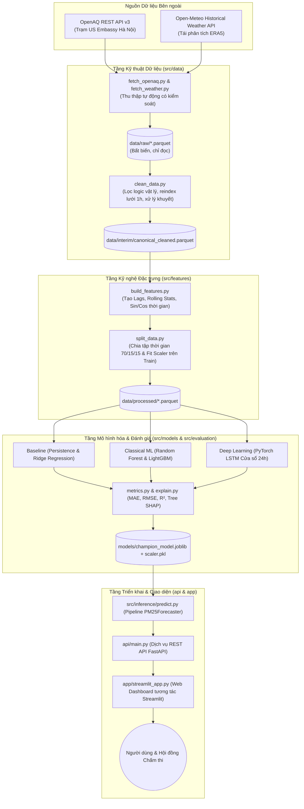

# Kiến Trúc Hệ Thống & Đặc Tả Kỹ Thuật

> **Đề tài:** Dự báo nồng độ bụi mịn $\text{PM}_{2.5}$ tại Hà Nội bằng Trí tuệ Nhân tạo  
> **Kiểu kiến trúc:** Pipeline đa tầng phân tách độc lập (*Decoupled Layered Architecture*)

---

## 1. Sơ Đồ Kiến Trúc Hệ Thống Tổng Thể

---

## 2. Đặc Tả Chi Tiết Từng Thành Phần

### 2.1. Tầng Dữ liệu (`src/data`)
- **Bộ thu thập tự động (`fetch_*.py`):** Client HTTP gửi yêu cầu định kỳ đến OpenAQ v3 và Open-Meteo, có cơ chế tự động thử lại (*exponential backoff*) và lưu trữ dữ liệu thô bất biến sang định dạng nén Parquet.
- **Làm sạch tất định (`clean_data.py`):**
  - Chuyển đổi toàn bộ mốc thời gian về múi giờ chuẩn `Asia/Ho_Chi_Minh` (UTC+7).
  - Áp dụng ràng buộc vật lý: $PM_{2.5} \le PM_{10} + 1.0\,\mu\text{g/m}^3$; $RH \in [0, 100\%]$; loại bỏ các mã lỗi ngụy trang (như `-999`).
  - Căn chỉnh chuỗi quan trắc về lưới giờ liên tục (`freq='1h'`). Áp dụng điền tiến (*forward-fill*) cho các khoảng khuyết vi mô $\le 2\text{ giờ}$; các khoảng gián đoạn lớn hơn được giữ nguyên `NaN` để loại bỏ khi trích xuất cửa sổ trượt.

### 2.2. Tầng Kỹ nghệ Đặc trưng (`src/features`)
- **Tạo đặc trưng trễ:** Tạo các cột trễ $t-1, t-3, t-6, t-12, t-24$ từ chuỗi $\text{PM}_{2.5}$.
- **Tạo đặc trưng thống kê trượt:** Tính giá trị trung bình trượt và độ lệch chuẩn trượt trên các cửa sổ 6h, 12h, 24h (dùng `shift(1)` để đảm bảo hoàn toàn nhân quả).
- **Mã hóa chu kỳ thời gian:** Áp dụng biến đổi hàm lượng giác $\sin/\cos$ cho giờ trong ngày và tháng trong năm.
- **Phân tách tập dữ liệu:** Chia mốc thời gian tuyến tính thành 3 tập riêng biệt: Train (70%), Validation (15%), Test (15%). Bộ chuẩn hóa `StandardScaler` được huấn luyện (*fit*) duy nhất trên tập Train và đóng gói thành tệp nhị phân lưu trữ.

### 2.3. Tầng Huấn luyện & Đánh giá Mô hình (`src/models`, `src/evaluation`)
- **Mô hình đối chứng cơ sở (`baseline.py`):** Mô hình ngây thơ Naive Persistence ($\hat{y}_{t+24} = y_t$) làm ngưỡng sàn đánh giá; mô hình hồi quy tuyến tính Ridge với tham số phạt $\alpha$.
- **Mô hình cây quyết định (`train_classical.py`):** LightGBM Regressor và Random Forest; tối ưu hóa siêu tham số có kiểm soát trên tập Validation.
- **Mô hình học sâu chuỗi (`train_lstm.py`):** Mạng nơ-ron PyTorch 2 tầng LSTM xử lý chuỗi tensor 3D `(batch_size, seq_len=24, n_features)` kèm cơ chế dừng sớm *EarlyStopping*.
- **Đánh giá & Giải thích (`metrics.py`, `explain.py`):** Báo cáo bộ ba chỉ số MAE, RMSE, $R^2$; phân tích biểu đồ phần dư trong các đợt ô nhiễm cực đoan; tính toán giá trị SHAP để phân tích vai trò của từng yếu tố khí tượng.

### 2.4. Tầng Đóng gói Suy luận & Phục vụ (`src/inference`, `api`)
- **Bộ suy luận độc lập (`PM25Forecaster`):** Lớp đóng gói toàn bộ quy trình: tiếp nhận chuỗi quan trắc 24 giờ gần nhất, kiểm tra định dạng, tạo đặc trưng, chuẩn hóa và gọi mô hình tốt nhất để trả về kết quả dự báo.
- **Dịch vụ REST API (`api/main.py`):** Xây dựng bằng FastAPI, hỗ trợ tài liệu tương tác tự động Swagger UI (`/docs`), bao gồm các endpoint:
  - `GET /health`: Kiểm tra trạng thái hệ thống.
  - `GET /model-info`: Cung cấp siêu tham số và độ đo thực nghiệm của mô hình quán quân.
  - `POST /predict`: Tiếp nhận payload JSON chứa dữ liệu quan trắc gần nhất, trả về giá trị nồng độ $\text{PM}_{2.5}$ dự báo sau 24h kèm khoảng tin cậy.

### 2.5. Giao diện Người dùng Tương tác (`app/streamlit_app.py`)
- Dashboard trực quan hóa hiển thị thẻ thông số hiện tại, biểu đồ đường so sánh thực tế vs. dự báo 24 giờ, thanh trượt mô phỏng kịch bản thời tiết (*What-if Scenario Simulator*), và thông tin giải thích mô hình phục vụ bảo vệ đồ án.
